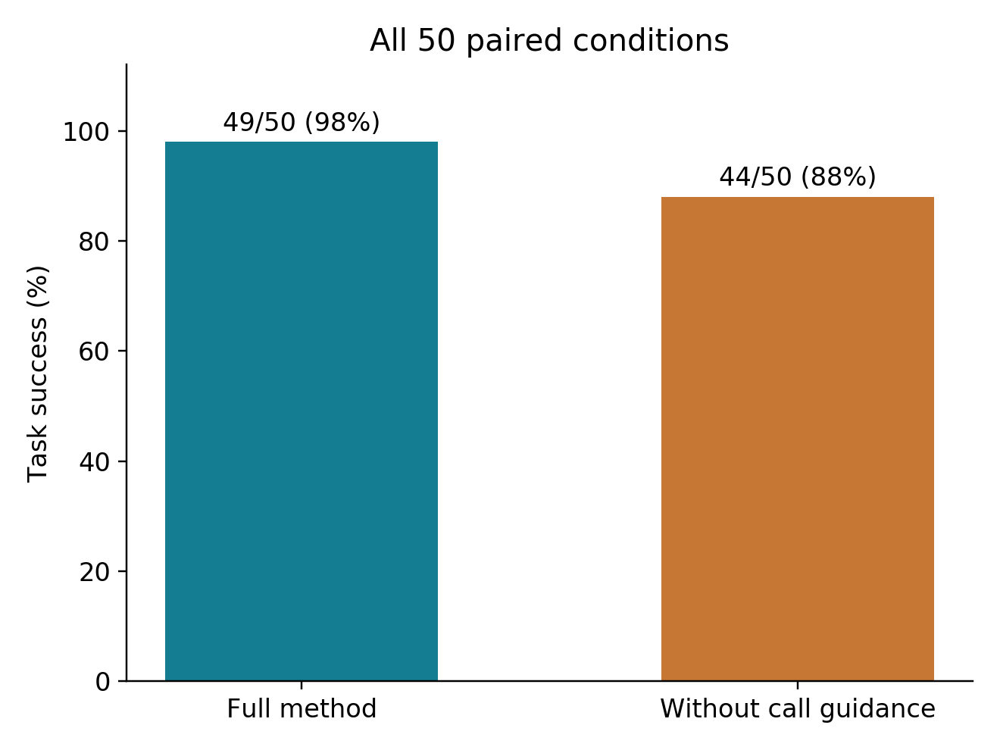
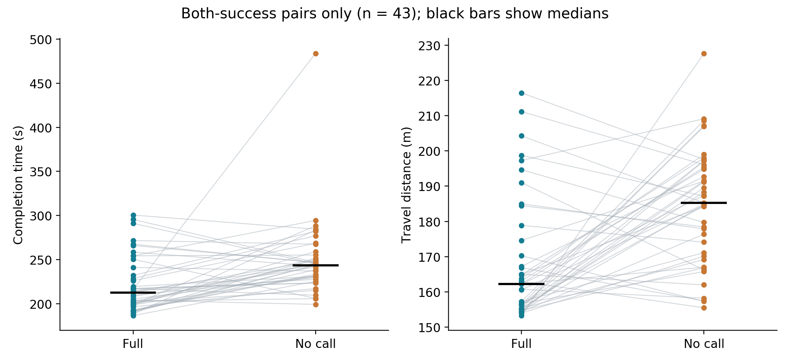

# Furnished multi-room paired evaluation

The task is to find four initially unknown victims across a furnished house, approach and confirm each through trigger-and-hold interaction, and continue until completion or 600 seconds. Rescue here is simulated confirmation, not casualty extraction or physical firefighting.

## Protocol and inclusion

Formal batch `20261007_135525` contains 50 pairs. Pair i uses seed 27000+i; odd pairs run full first, even pairs no_call first. Geometry and victim positions remain fixed. The seed controls prescribed random inputs, including selection of two fire carriers from twelve candidates. Different seeds need not produce different fire combinations. These are repetitions in one house, not fifty independent buildings. The ablation disables call guidance while retaining common visual, planning, safety and confirmation logic.

- Keep all 100 primary terminal outcomes, including seven valid timeouts.
- Retain pair 34 original `20261007_193332_no_call`: readiness/integrity passed, 9.078 m movement, 600.138 s timeout, 0/4 confirmed. An infrastructure cause was suspected but not established.
- Its successful retry `20261007_194832_no_call` is supplementary, not a replacement in the primary analysis.
- Exclude pair 30 failed start `20261007_184809_full`: zero odometry/scan/image/nonzero-command counts and failed integrity. Count its valid replacement once. This denominator does not measure overall startup availability.
- Qualification pilots, development batches, historical 200 trials, selected 30 local-obstacle trials and the demonstration are separate datasets.

## Results

| Metric | Full | No call |
|---|---:|---:|
| Terminal trials | 50 | 50 |
| Success | 49 | 44 |
| Timeout | 1 | 6 |
| Completion | 98% | 88% |
| Mean time (s), both-success pairs | 221.25 | 248.86 |
| Mean distance (m), both-success pairs | 168.16 | 184.44 |

There are 43 both-success pairs, six full-only successes and one no-call-only success. Exact two-sided McNemar p=0.125; the success difference is not conclusive at the 5% level.

For 43 both-success pairs, mean full-minus-no-call differences are −27.61 s and −16.28 m. Exploratory paired percentile-bootstrap 95% intervals are [−43.75,−14.12] s and [−23.30,−9.38] m (20,000 paired resamples, seed 20261007). These are conditional costs, not efficiency estimates covering failures. Short failed travel is not efficient rescue.

All seven failures are listed in [main_timeouts.csv](../results/multiroom_20261007/main_timeouts.csv). Pairs 34 and 36 travel under 10 m; pair 29 travels 506.563 m with only 1/4 confirmed. Low motion and extended unsuccessful searching both occur. These observations are not a proven root-cause distribution.

Replacing pair 34 with the successful retry would yield 45/50 no-call successes and p=0.21875. That supplementary set has 44 both-success pairs, mean times 221.25/250.29 s and distances 168.04/185.07 m. The primary analysis does not make this replacement.

## Recompute and inspect

Run `python3 results/multiroom_20261007/analyze_paired_results.py` with NumPy and Matplotlib installed. It reads terminal CSV/JSON records without modifying them and writes an `analysis_paired_20261007` subdirectory. Source paths appear in `main_trials.csv`; hashes are in `source_sha256.json`. Frozen source subset, scene, schedule and manifests are under `formal_batches/20261007_135525`. The historical `paired_plan.json` retains its preparation-time status. `completed.json` records the later selection including the retry; the analysis explicitly restores the original pair-34 result.

The frozen source subset is audit material, not a standalone distribution. External dependency source archives, model weights and local workspaces are not redistributed. A dependency manifest records provenance, not installation. Do not overlay this subset onto the older release and assume exact reproduction. Fresh-machine end-to-end reproduction remains unverified. Post-batch video-display hooks are not formal frozen code.

## Limits

The system was frozen after development, with fixed geometry and victim positions. Same seeds do not remove timing nondeterminism. Simulated calls, class-coded pseudo-thermal images, idealised pose and fire ground truth do not validate real sensing or real-fire performance. Furnishing improves scene content, not sensor physics. The study does not isolate every planning or recovery component.
